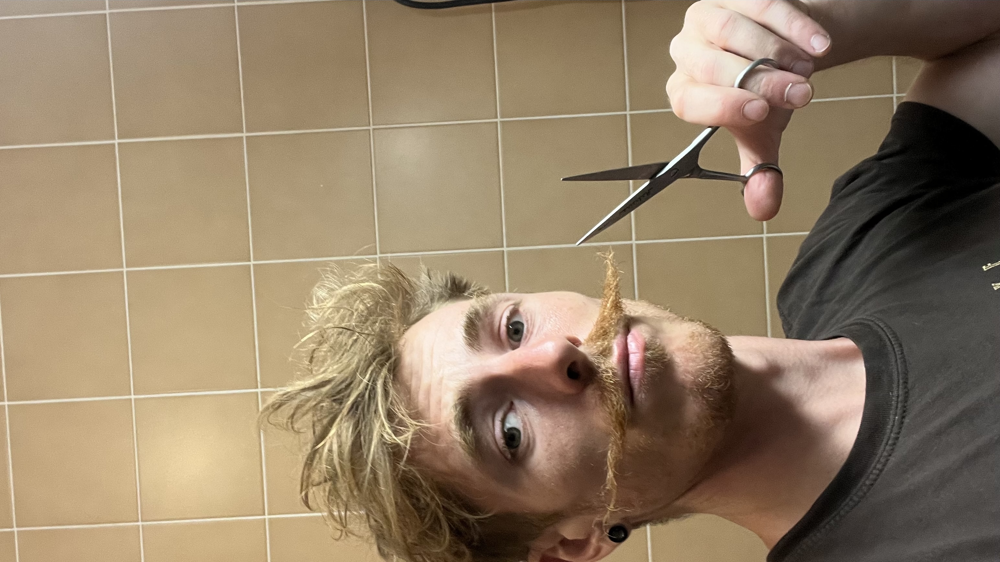

# Upload a new image

1. Go on [Inky Feed](https://kdrive.infomaniak.com/app/collaborate/929618/7879be08-f7bd-4651-8580-b5cdf75b5a36) dropbox.
2. Enter the password
3. Upload your image

## Note

All images will be displayed in portrait mode. Landscape formats will then be cropped

*Like that* :

